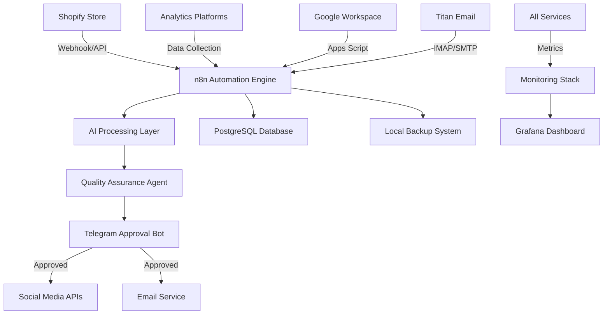

# Raspberry Pi 4 E-commerce Business Automation System
## Technical Specification v1.0

---

## Executive Summary

This specification outlines the design and implementation of a self-hosted business automation system running on a Raspberry Pi 4 (4GB RAM) with a 2TB external SSD. The system will automate social media management, customer communications, accounting, and B2B outreach for an e-commerce business operating on Shopify. The solution emphasizes autonomous operation with intelligent oversight, enabling a small team to efficiently scale business operations.

---

## 1. System Overview

### 1.1 Purpose
Build a comprehensive AI-powered automation platform that handles:
- Social media content creation and posting (Instagram, Facebook, TikTok, LinkedIn)
- Email processing and intelligent response generation
- Business accounting and financial tracking
- B2B outreach automation to local salons and businesses
- Analytics tracking and performance optimization
- Task management and calendar automation

### 1.2 Core Principles
- **Autonomous Operation**: System runs independently with minimal human intervention
- **Intelligent Oversight**: AI quality assurance with human approval via Telegram
- **Scalability**: Built to grow from 10 to 1000+ orders without architecture changes
- **Data-Driven**: All decisions based on collected analytics and performance metrics
- **Privacy-First**: Self-hosted solution maintaining complete data control

---

## 2. Hardware Configuration

### 2.1 Primary Hardware
- **Device**: Raspberry Pi 4 Model B
- **RAM**: 4GB LPDDR4
- **Primary Storage**: 2TB External SSD via USB 3.0
- **Boot Storage**: 32GB microSD card (for bootloader only)
- **Cooling**: Active cooling with heatsink and fan
- **Power Supply**: Official 5.1V/3.5A USB-C power adapter
- **Network**: Ethernet connection (preferred) or WiFi

### 2.2 Performance Optimizations
- Boot from external SSD for 3-4x performance improvement
- ZRAM compression to effectively triple available RAM
- GPU memory split reduced to 32MB (headless operation)
- Overclocking to 2.0GHz CPU with active cooling
- Swap file on SSD with swappiness=10

### 2.3 Storage Allocation
```
2TB SSD Layout:
├── OS & System (50GB)
├── Docker Volumes (100GB)
├── AI Models & Training Data (200GB)
├── Content Repository (500GB)
├── Analytics Data (150GB)
├── Database Storage (100GB)
├── Backup Storage (800GB)
└── Reserved/Swap (100GB)
```

---

## 3. Software Architecture

### 3.1 Core Technology Stack

#### Operating System
- **OS**: Raspberry Pi OS Lite (64-bit, Debian-based)
- **Kernel**: Latest stable with real-time patches
- **Init System**: systemd with service orchestration

#### Container Platform
- **Docker**: v24.0+ with Docker Compose v2.20+
- **Portainer**: Web-based container management
- **Watchtower**: Automated container updates

#### Automation & Workflow
- **n8n**: Primary workflow automation engine
- **Node-RED**: IoT and device integration
- **Apache Airflow**: Complex scheduling and DAG management

#### AI & Machine Learning
- **Gemini API**: Cloud-based LLM for content generation and processing
- **LangChain**: AI orchestration and chain management
- **ChromaDB**: Vector database for email training data
- **Whisper API**: Cloud-based voice transcription
- **Hugging Face Transformers**: Lightweight models only

#### Data Management
- **PostgreSQL**: Primary relational database
- **Redis**: Caching and session management
- **MinIO**: S3-compatible object storage for media
- **InfluxDB**: Time-series data for analytics

#### Web Services
- **Nginx**: Reverse proxy and load balancer
- **Nextcloud**: File storage and collaboration
- **Grafana**: Metrics visualization
- **Prometheus**: Metrics collection

#### Security & Access
- **WireGuard**: VPN for secure remote access
- **Authelia**: Single sign-on and 2FA
- **Fail2ban**: Intrusion prevention
- **ClamAV**: Antivirus scanning

### 3.2 Integration Architecture



---

## 4. Functional Specifications

### 4.1 Social Media Automation

#### Content Generation Pipeline
1. **Data Input Sources**:
   - Product catalog from Shopify
   - Trending topics from social media APIs
   - Historical performance data
   - Competitor analysis data

2. **AI Content Creation**:
   - Generate 3 feed posts daily for Instagram
   - Create hourly story content variations
   - Adapt content for Facebook and TikTok formats
   - Professional content for LinkedIn (when needed)

3. **Quality Assurance Flow**:
   ```
   Generate Content → QA Agent Review → Confidence Score
   ├── Score > 85%: Auto-publish
   ├── Score 70-85%: Telegram approval required
   └── Score < 70%: Regenerate with feedback
   ```

4. **Publishing Schedule**:
   - Instagram: 9 AM, 2 PM, 7 PM (optimal engagement times)
   - Stories: Every hour from 8 AM to 10 PM
   - Cross-posting to Facebook with platform-specific adaptations
   - TikTok: 3-5 times per week

5. **Performance Tracking**:
   - Engagement rates per post
   - Follower growth metrics
   - Click-through to Shopify
   - Story completion rates
   - A/B testing results

### 4.2 Email Intelligence System

#### Email Processing Pipeline
1. **Collection & Training**:
   - Import 50-100 reference emails via IMAP
   - Extract patterns, tone, and structure
   - Build vector embeddings in ChromaDB
   - Fine-tune response generation model

2. **Automated Responses**:
   - Customer inquiries (FAQs, order status)
   - B2B outreach templates
   - Follow-up sequences
   - Newsletter content

3. **B2B Outreach Automation**:
   - Identify local salons and businesses
   - Personalized outreach campaigns
   - Follow-up scheduling
   - Response tracking and CRM updates

### 4.3 Business Intelligence & Accounting

#### Financial Tracking
1. **Data Sources**:
   - Shopify orders and refunds
   - Payment processor transactions
   - Expense tracking via receipt scanning
   - Inventory management

2. **Automated Accounting**:
   - **Software**: Akaunting (open-source)
   - Daily P&L calculations
   - Tax preparation assistance
   - Cash flow projections
   - Inventory valuation

3. **Reporting**:
   - Daily sales summaries
   - Weekly performance reports
   - Monthly financial statements
   - Custom alerts for anomalies

### 4.4 Task & Calendar Management

#### Automation Features
1. **Task Generation**:
   - Convert emails to tasks
   - Create tasks from Shopify orders
   - Generate follow-ups from customer interactions
   - Schedule inventory reordering

2. **Calendar Integration**:
   - Google Calendar sync via Apps Script
   - Automated meeting scheduling
   - Deadline tracking
   - Team availability management

3. **Reminder System**:
   - Telegram notifications for urgent tasks
   - Email digests for daily planning
   - SMS alerts for critical events

---

## 5. Security Specifications

### 5.1 Access Control

#### Authentication Layers
1. **Primary Access**:
   - SSH key-based authentication only
   - Non-standard SSH port (e.g., 2222)
   - Fail2ban with aggressive blocking

2. **Web Interface Access**:
   - Authelia SSO for all web services
   - TOTP-based 2FA mandatory
   - Session timeout after 30 minutes

3. **Remote Access**:
   - WireGuard VPN required for external access
   - IP whitelisting for critical services
   - Geo-blocking for non-business regions

### 5.2 Data Security

#### Encryption Standards
1. **Data at Rest**:
   - Full disk encryption with LUKS
   - Database encryption with transparent data encryption
   - Backup encryption with AES-256

2. **Data in Transit**:
   - TLS 1.3 for all web services
   - VPN tunnel for remote connections
   - Encrypted API communications

#### API Key Management
1. **Storage**:
   - Environment variables in Docker secrets
   - Encrypted key vault using Mozilla SOPS
   - Regular key rotation (90 days)

2. **Access Patterns**:
   - Principle of least privilege
   - Service-specific API keys
   - Rate limiting on all endpoints

### 5.3 Audit & Compliance

#### Logging Strategy
1. **Audit Logs**:
   - All user actions logged with timestamps
   - API calls tracked with source IPs
   - File access monitoring
   - Database query logging

2. **Change Tracking**:
   - Git-based configuration management
   - Database audit tables
   - Content version history
   - User attribution for all changes

---

## 6. Backup & Recovery

### 6.1 Backup Strategy

#### Automated Backups
1. **Frequency**:
   - Database: Every 6 hours
   - Configuration: Daily
   - Content: Daily incremental, weekly full
   - AI Models: Weekly

2. **Retention Policy**:
   - Daily backups: 7 days
   - Weekly backups: 4 weeks
   - Monthly backups: 12 months
   - Annual backups: 3 years

3. **Storage Locations**:
   - Primary: Local 2TB SSD dedicated partition
   - Secondary: Network-attached storage (if available)
   - Tertiary: Encrypted cloud storage (optional)

### 6.2 Disaster Recovery

#### Recovery Procedures
1. **Recovery Time Objectives**:
   - Critical services: < 1 hour
   - Full system: < 4 hours
   - Data recovery: < 30 minutes

2. **Automated Recovery**:
   - Docker Compose for service restoration
   - Database point-in-time recovery
   - Configuration state management
   - Automated health checks

---

## 7. Monitoring & Alerting

### 7.1 System Monitoring

#### Metrics Collection
1. **Infrastructure Metrics**:
   - CPU usage and temperature
   - Memory utilization
   - Disk I/O and space
   - Network throughput
   - Container resource usage

2. **Application Metrics**:
   - API response times
   - Workflow execution success rates
   - AI model inference times
   - Queue depths
   - Error rates

### 7.2 Alerting Rules

#### Alert Priorities
1. **Critical (Immediate Telegram notification)**:
   - System down or unresponsive
   - Storage > 90% full
   - Security breach detected
   - Backup failure
   - Temperature > 80°C

2. **Warning (Email notification)**:
   - Storage > 75% full
   - High error rates
   - Slow response times
   - Failed workflows
   - Memory pressure

3. **Info (Dashboard only)**:
   - Successful backups
   - Routine maintenance
   - Performance metrics
   - Usage statistics

---

## 8. Implementation Plan

### 8.1 Phase 1: Foundation (Week 1)
- [ ] Hardware setup with SSD and cooling
- [ ] OS installation and optimization
- [ ] Docker and Portainer deployment
- [ ] Basic security configuration
- [ ] VPN and remote access setup

### 8.2 Phase 2: Core Services (Week 2)
- [ ] PostgreSQL and Redis deployment
- [ ] n8n installation and configuration
- [ ] Nextcloud setup for file storage
- [ ] Basic monitoring with Grafana
- [ ] Backup system implementation

### 8.3 Phase 3: AI Integration (Week 3)
- [ ] Gemini API integration and authentication
- [ ] ChromaDB for vector storage
- [ ] Email training pipeline
- [ ] Content generation workflows
- [ ] QA agent implementation

### 8.4 Phase 4: Automation Workflows (Week 4)
- [ ] Shopify integration
- [ ] Social media API connections
- [ ] Telegram bot deployment
- [ ] Google Workspace integration
- [ ] Email automation setup

### 8.5 Phase 5: Business Logic (Week 5)
- [ ] Accounting system deployment
- [ ] Analytics data collection
- [ ] B2B outreach workflows
- [ ] Task management automation
- [ ] Reporting dashboards

### 8.6 Phase 6: Optimization & Testing (Week 6)
- [ ] Performance tuning
- [ ] Security hardening
- [ ] Load testing
- [ ] Disaster recovery testing
- [ ] Documentation completion

---

## 9. Performance Requirements

### 9.1 System Performance
- **CPU Usage**: < 70% average, < 90% peak
- **Memory Usage**: < 3GB steady state
- **Storage I/O**: > 200 MB/s read, > 150 MB/s write
- **Network Latency**: < 100ms to external services
- **System Uptime**: > 99.5% (< 3.65 hours downtime/month)

### 9.2 Application Performance
- **Content Generation**: < 30 seconds per post
- **Email Processing**: < 5 seconds per email
- **Workflow Execution**: < 2 minutes for complex flows
- **API Response**: < 500ms for 95th percentile
- **Backup Completion**: < 30 minutes for daily backup

---

## 10. Scalability Considerations

### 10.1 Growth Projections
- **Year 1**: 10-50 orders/day, 1000 emails/month
- **Year 2**: 50-200 orders/day, 5000 emails/month
- **Year 3**: 200-500 orders/day, 15000 emails/month

### 10.2 Scaling Strategy
1. **Vertical Scaling**:
   - Upgrade to Raspberry Pi 5 (8GB RAM)
   - Add additional SSD for storage
   - Implement read replicas for database

2. **Horizontal Scaling**:
   - Add second Pi for load distribution
   - Separate AI workloads to dedicated device
   - Cloud hybrid for peak loads

3. **Optimization Priorities**:
   - Database query optimization
   - Caching layer expansion
   - CDN for static content
   - Async processing for heavy tasks

---

## 11. Maintenance & Operations

### 11.1 Regular Maintenance
- **Daily**: Review error logs, check backup status
- **Weekly**: Update containers, review performance metrics
- **Monthly**: Security patches, storage cleanup
- **Quarterly**: Full system backup test, security audit

### 11.2 Documentation Requirements
- System architecture diagram
- API documentation
- Workflow documentation
- Troubleshooting guide
- Disaster recovery procedures
- User manual for team members

---

## 12. Success Metrics

### 12.1 Technical KPIs
- System uptime > 99.5%
- Backup success rate = 100%
- Average response time < 1 second
- Error rate < 0.1%
- Storage utilization < 80%

### 12.2 Business KPIs
- Social media engagement increase > 50%
- Email response time < 1 hour
- B2B outreach conversion > 10%
- Manual task reduction > 80%
- Revenue per employee increase > 100%

---

## 13. Risk Management

### 13.1 Identified Risks
1. **Hardware Failure**: Mitigated by regular backups and spare Pi
2. **Security Breach**: Mitigated by defense-in-depth security
3. **API Changes**: Mitigated by abstraction layers
4. **Scaling Issues**: Mitigated by modular architecture
5. **Network Outage**: Mitigated by local caching and queuing

### 13.2 Contingency Plans
- Spare Raspberry Pi 4 on standby
- Manual override procedures documented
- Cloud backup for critical data
- Fallback to manual processes defined
- Emergency contact list maintained

---

## 14. Budget Considerations

### 14.1 Initial Investment
- Raspberry Pi 4 (4GB): $75
- 2TB SSD: $100
- Cooling solution: $25
- Power supply: $15
- Miscellaneous cables: $20
- **Total Hardware**: ~$235

### 14.2 Ongoing Costs
- Electricity: ~$5/month
- Internet bandwidth: Existing
- API costs: Covered by free tiers initially
- Cloud backup (optional): $10/month
- **Total Monthly**: ~$5-15

### 14.3 ROI Projection
- Time saved: 20-30 hours/week
- Increased sales from automation: 20-40%
- Reduced errors: 90%
- **Payback period**: < 2 months

---

## 15. Future Enhancements

### 15.1 Short-term (3-6 months)
- Voice assistant integration
- Mobile app for management
- Advanced AI models (Claude API, GPT-4)
- Multi-language support
- A/B testing automation

### 15.2 Long-term (6-12 months)
- Computer vision for product photography
- Predictive analytics for inventory
- Customer service chatbot
- Blockchain integration for supply chain
- IoT sensor integration for warehousing

---

## Appendices

### A. Configuration Files
- Docker Compose templates
- n8n workflow examples
- Nginx configuration
- Backup scripts
- Security policies

### B. API Integrations
- Shopify API endpoints
- Instagram Graph API
- Google Workspace APIs
- Telegram Bot API
- Analytics APIs

### C. Training Resources
- Team training materials
- Video tutorials
- Troubleshooting guides
- Best practices documentation

---

## Document Control
- **Version**: 1.0
- **Date**: 2024
- **Status**: Final Specification
- **Next Review**: After Phase 1 Implementation

---

*This specification provides a comprehensive blueprint for building a robust, scalable, and intelligent business automation system on Raspberry Pi 4 hardware. The modular architecture ensures flexibility while maintaining security and performance standards suitable for production e-commerce operations.*